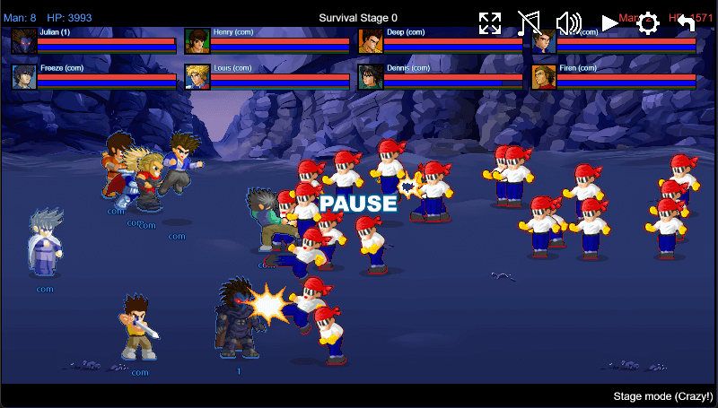
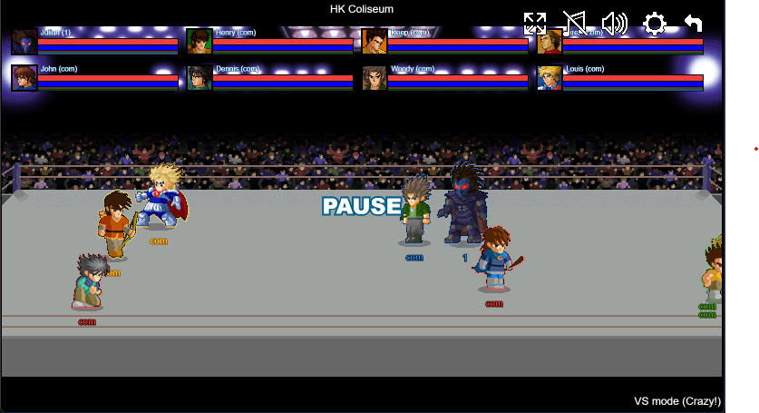

# Little Fighter Wemake

[中文](./README.MD) | [English](./README.EN.MD)  

try it at [https://lf.gim.ink/](https://lf.gim.ink/)

Think this project is pretty good? Consider starring it!

**gameplays, arts, and sounds are all from "Litter Fighter 2" basically, created by Marti Wong and Starsky Wong in 1999.

"Little Fighter Wemake" created by Gim in 2024."**

**The original author, Marti Wong, has now launched "[Little Fighter 2 Remastered](https://lf2.net/)". Please purchase it on [Steam](https://store.steampowered.com/app/3249650) to support the original author.**

## Links

- [CHANGELOG](./CHANGELOG.EN.MD)
- [Multiplayer Online Game](./docs/Multiplayer%20Online%20Game/README.EN.MD)
- [Building and Running](./docs/Build%20Instructions/README.EN.MD)
- [Custom Game](./docs/Custom%20Game/README.MD)
- [Feedback & Discussions](https://github.com/gimhol/little-fighter-2-WEMAKE/discussions)

## Screenshots

## What's next?

- Support for 3D models and animations?
- Support for more diverse level functions?
- Continuing to implement other game modes of LF2?
- Video recording and playback?
