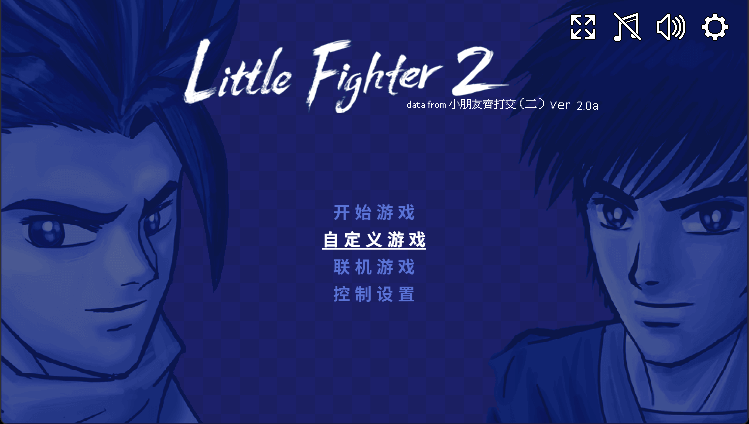
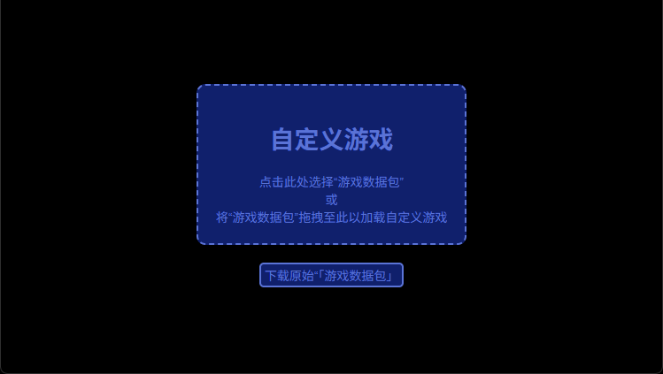
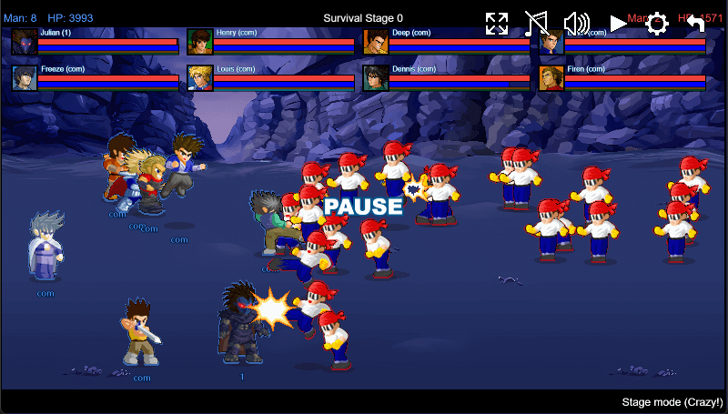
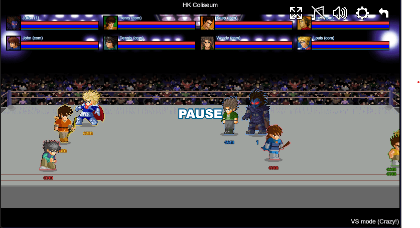

# [LFW] v0.1.9

“嗨嗨嗨，我又来了嗷。”

贴吧现在弄成这样，让我多发几个又何妨？[表情]

处理了些比较重要的问题，以及加了点想要的东西

- fix: 被攻击者将正确的掉落其持有的重型武器
- fix: 调整棒球类武器击中与被击中的表现
- fix: 回旋镖现在能跟踪敌人了
- feat: 房间列表可以看见自己延迟
- feat: 房间中可以看见房间成员的延迟
- fix: 修复bot不出招以及太会防御的问题
- feat: 支持自定义游戏
- feat: 添加“队伍描边”效果
- fix: 修复背景与关卡按钮无法响应的问题
- fix: 修复分数版显示不正确的问题

============================================

“自定义游戏”其实就是允许加载别的数据包（但目前除了原始数据包，还没别的能用）。

你可以在图二中下载“原始数据包”来尝试这个功能

============================================

“队伍描边”效果

主要是用来区分敌友的，比如闯关模式，其实你不太能搞清楚一个远处朝你飞来的BALL是谁的…

于是就有了下图的效果（后续可能会想个办法允许关闭这个效果）

============================================

现在能在游戏开始前看每个人的延迟，方便延迟比较大的调整网络。

后续也许能在游戏开始后也能看这个。

但游戏慢不仅要考虑“往返延迟”，

还要考虑每帧耗时（设备性能有关），后面也许也会加上这个。
